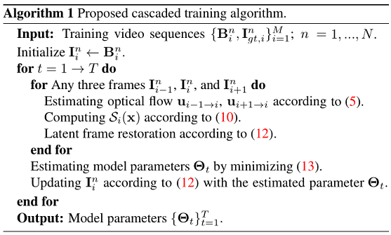

# CDVD-TSP
#### [Paper](https://csbhr.github.io/projects/cdvd-tsp/index.html) | [Project Page](https://csbhr.github.io/projects/cdvd-tsp/index.html) | [Discussion](https://csbhr.github.io/projects/cdvd-tsp/index.html)
### Cascaded Deep Video Deblurring Using Temporal Sharpness Prior
By [Jinshan Pan](https://jspan.github.io/), [Haoran Bai](https://csbhr.github.io/), Jinhui Tang


## Updates
- [2020-03-07] Add training code!
- [2020-03-04] Testing code is available!

## Proposed Algorithm
The proposed algorithm contains the optical flow estimation module, latent image restoration module, and the temporal sharpness prior.

#### Temporal sharpness prior
As demonstrated in [4], the blur in the video is irregular, and thus there exist some pixels that are not blurred. Following the conventional method [4], we explore these sharpness pixels to help video deblurring. The sharpness prior is defined as:  
  
where   is defined as .  
Based on (10), if the value of  is close to 1, the pixel x is likely to be clear. Thus, we can use  to help the deep neural network to distinguish whether the pixel is clear or not so that it can help the latent frame restoration. To increase the robustness of , we define  as:  

where  denotes an image patch centerd at pixel x .
#### Cascaded Training
As the proposed algorithm estimates optical flow from intermediate latent frames as the motion blur information, it requires a feedback loop. To effectively train the proposed algorithm, we develop a cascaded training approach and jointly train the proposed model in an end-to-end manner. The main steps of the cascaded training approach is as follows, where T denotes the number of stages:  


## Experimental Results
Quantitative evaluations on the video deblurring dataset [25] in terms of PSNR and SSIM. All the comparison results are generated using the publicly available code. All the restored frames instead of randomly selected 30 frames from each test set [25] are used for evaluations.

Deblurred results on the test dataset [25]. The deblurred results in (c)-(g) still contain significant blur effects. The proposed algorithm generates much clearer frames.


## Dependencies

- Linux (Tested on Ubuntu 18.04)
- Python 3 (Recommend to use [Anaconda](https://www.anaconda.com/download/#linux))
- [PyTorch 0.4.1](https://pytorch.org/): `conda install pytorch=0.4.1 torchvision cudatoolkit=9.2 -c pytorch`
- numpy: `conda install numpy`
- matplotlib: `conda install matplotlib`
- opencv: `conda install opencv`
- imageio: `conda install imageio`
- skimage: `conda install scikit-image`
- tqdm: `conda install tqdm`
- cupy: `conda install -c anaconda cupy`

## Get Started

### Download
- Pretrained models and Datasets can be downloaded from [Here](https://drive.google.com/drive/folders/1lw_1jITafEQ9DvMys_S6aYwtNApYKWsz?usp=sharing).
	- If you have downloaded the pretrained models，please put them to './pretrain_models'.
	- If you have downloaded the datasets，please put them to './dataset'.

### Dataset Organization Form
If you prepare your own dataset, please follow the following form:
```
|--dataset  
    |--blur  
        |--video 1
            |--frame 1
            |--frame 2
                ：  
        |--video 2
            :
        |--video n
    |--gt
        |--video 1
            |--frame 1
            |--frame 2
                ：  
        |--video 2
        	:
        |--video n
```

### Testing

#### Quick Test
- Download the pretrained models.
- Download the testing dataset.
- Run the following commands:
```
cd ./code
python inference.py --default_data DVD
```
  - --default_data: the dataset you want to test, optional: DVD, GOPRO
- The deblured result will be in './infer_results'.

#### Test Your Own Dataset
- Download the pretrained models.
- Organize your dataset like the above form.
- Run the following commands:
```
cd ./code
python inference.py --data_path path/to/data --model_path path/to/pretrained/model
```
  - --data_path: the path of your dataset.
  - --model_path: the path of the downloaded pretrained model.
- The deblured result will be in './infer_results'.

### Training
- Download the PWC-Net pretrained model.
- Download training dataset, or prepare your own dataset like above form.
- Run the following commands:
```
cd ./code
python main.py --save path/to/save --dir_data path/to/train/dataset --dir_data_test path/to/val/dataset --epochs 500 --batch_size 8
```
  - --save: the experiment result will be in './experiment/save'.
  - --dir_data: the path of the training dataset.
  - --dir_data_test: the path of the evaluating dataset during training process.
  - --epochs: the number of training epochs.
  - --batch_size: the mini batch size.

## Citation
```
@inproceedings{CDVD-TSP,
  title={Cascaded Deep Video Deblurring Using Temporal Sharpness Prior},
  author={Bai, Haoran and Pan, Jinshan and Tang, Jinhui},
  booktitle={IEEE Conference on Computer Vision and Pattern Recognition},
  year={2020}
}
```
