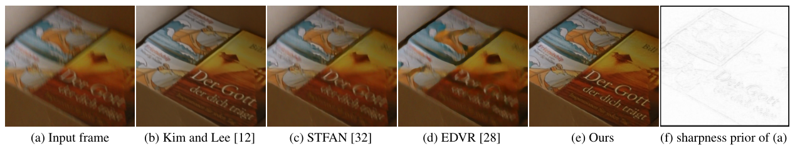
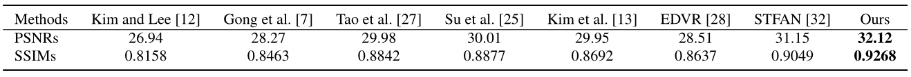
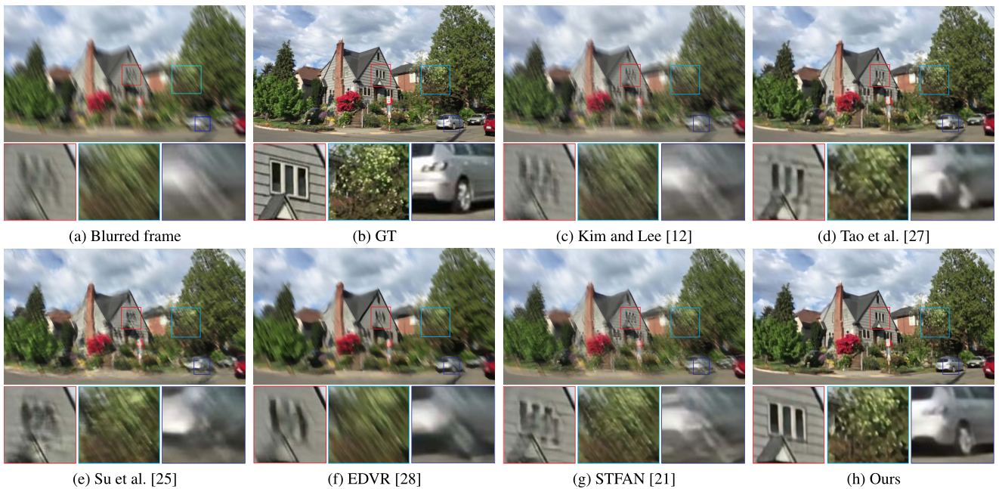

# CDVD-TSP

[](https://github.com/csbhr/CDVD-TSP/blob/master/LICENSE)
[](https://www.python.org/)
[](https://pytorch.org/)

#### [Paper](https://csbhr.github.io/projects/cdvd-tsp/index.html) | [Project Page](https://csbhr.github.io/projects/cdvd-tsp/index.html) | [Discussion](https://github.com/csbhr/CDVD-TSP/issues)
### Cascaded Deep Video Deblurring Using Temporal Sharpness Prior
By [Jinshan Pan](https://jspan.github.io/), [Haoran Bai](https://csbhr.github.io/), Jinhui Tang

## Updates
- [2020-03-07] Add training code!
- [2020-03-04] Testing code is available!

## Experimental Results
Deblurred result on a real challenging video. Our algorithm is motivated by the success of variational model-based methods. It explores sharpness pixels from adjacent frames by a temporal sharpness prior (see (f)) and restores sharp videos by a cascaded inference process. As our analysis shows, enforcing the temporal sharpness prior in a deep convolutional neural network (CNN) and learn it by a cascaded inference manner is able to make the deep CNN more compact and thus generates better deblurred results than both the CNN-based methods [28, 32] and variational model-based method [12]. All the compared results are obtained from the reported results.  
  
Quantitative evaluations on the video deblurring dataset [25] in terms of PSNR and SSIM. All the comparison results are generated using the publicly available code. All the restored frames instead of randomly selected 30 frames from each test set [25] are used for evaluations.  
  
Deblurred results on the test dataset [25]. The deblurred results in (c)-(g) still contain significant blur effects. The proposed algorithm generates much clearer frames.  


## Dependencies

- Linux (Tested on Ubuntu 18.04)
- Python 3 (Recommend to use [Anaconda](https://www.anaconda.com/download/#linux))
- [PyTorch 0.4.1](https://pytorch.org/): `conda install pytorch=0.4.1 torchvision cudatoolkit=9.2 -c pytorch`
- numpy: `conda install numpy`
- matplotlib: `conda install matplotlib`
- opencv: `conda install opencv`
- imageio: `conda install imageio`
- skimage: `conda install scikit-image`
- tqdm: `conda install tqdm`
- cupy: `conda install -c anaconda cupy`

## Get Started

### Download
- Pretrained models and Datasets can be downloaded [Here](https://drive.google.com/drive/folders/1lw_1jITafEQ9DvMys_S6aYwtNApYKWsz?usp=sharing).
	- If you have downloaded the pretrained models，please put them to './pretrain_models'.
	- If you have downloaded the datasets，please put them to './dataset'.

### Dataset Organization Form
If you prepare your own dataset, please follow the following form:
```
|--dataset  
    |--blur  
        |--video 1
            |--frame 1
            |--frame 2
                ：  
        |--video 2
            :
        |--video n
    |--gt
        |--video 1
            |--frame 1
            |--frame 2
                ：  
        |--video 2
        	:
        |--video n
```

### Training
- Download the PWC-Net pretrained model.
- Download training dataset, or prepare your own dataset like above form.
- Run the following commands:
```
cd ./code
python main.py --save path/to/save --dir_data path/to/train/dataset --dir_data_test path/to/val/dataset --epochs 500 --batch_size 8
	# --save: the experiment result will be in './experiment/save'.
	# --dir_data: the path of the training dataset.
	# --dir_data_test: the path of the evaluating dataset during training process.
	# --epochs: the number of training epochs.
	# --batch_size: the mini batch size.
```

### Testing

#### Quick Test
- Download the pretrained models.
- Download the testing dataset.
- Run the following commands:
```
cd ./code
python inference.py --default_data DVD
	# --default_data: the dataset you want to test, optional: DVD, GOPRO
```
- The deblured result will be in './infer_results'.

#### Test Your Own Dataset
- Download the pretrained models.
- Organize your dataset like the above form.
- Run the following commands:
```
cd ./code
python inference.py --data_path path/to/data --model_path path/to/pretrained/model
	# --data_path: the path of your dataset.
	# --model_path: the path of the downloaded pretrained model.
```
- The deblured result will be in './infer_results'.

## Citation
```
@inproceedings{CDVD-TSP,
  title={Cascaded Deep Video Deblurring Using Temporal Sharpness Prior},
  author={Pan, Jinshan and Bai, Haoran and Tang, Jinhui},
  booktitle={IEEE Conference on Computer Vision and Pattern Recognition},
  year={2020}
}
```
